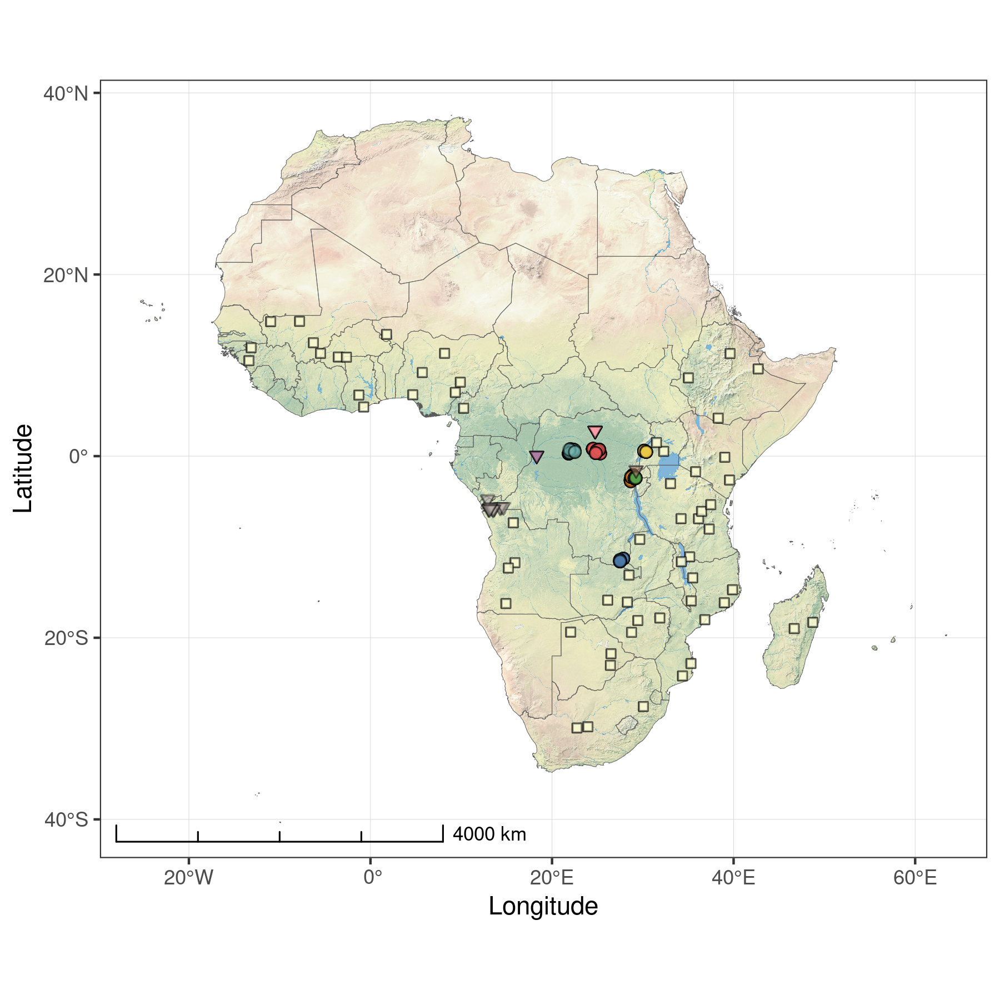

The Central African Soil Spectral Library: A new soil infrared
repository and a geographical prediction analysis
================
Laura Summerauer, Philipp Baumann, Leonardo Ramirez-Lopez, Matti
Barthel, Marijn Bauters, Benjamin Bukombe, Mario Reichenbac, Pascal
Boeckx, Elizabeth Kearsley, Kristof Van Oost, Bernard Vanlauwe,
Dieudonné Chiragaga, Aimé Bisimwa Heri-Kazi, Pieter Moonen, Andrew
Sila, Keith Shepherd, Basile Bazirake Mujinya, Eric Van Ranst, Geert
Baert, Sebastian Doetterl and Johan Six

# Overview

This is a repository with codes and data, basing on the manuscript “The
Central African Soil Spectral Library: A new soil infrared repository
and a geographical prediction analysis”. The material within this
repository allows to reproduce our obtained results.

  - **R**: R scripts
  - **R/Rhelper**: R functions and helpers
  - **data**: chemical reference data, field metadata and mid-infrared
    spectra
  - **img**: graphs
  - **out**: processed data

# Sample locations

Figure 1: Sample locations of the Central African Soil Spectral Library
(CSSL SSL; circle and triangle symbols) and the continental SSL ([AfSIS
SSL](https://worldagroforestry.org/sd/landhealth/soil-plant-spectral-diagnostics-laboratory/soil-spectra-library);
square symbols). Samples with circle and square symbols have been used
for the regional analysis.

